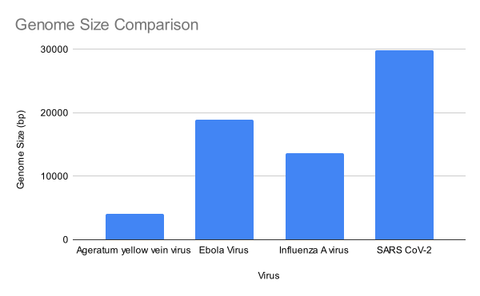
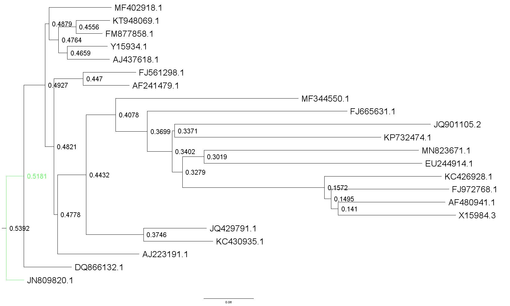

# Introduction
Make sure to have a look at the suggested powerpoint to help guide you! Include some pictures (make sure to cite sources!)

- **Viral classification:**  
  - *ICTV classification*: Monodnaviria[^1].  
  - *Baltimore classification*: Class II; ssDNA(+/-). Single-stranded DNA (ssDNA) are strands of nucleic acids lacking in hydrogen bonds typically found in viruses.

- **Physical size:**  
  - The physical size of Ageratum yellow vein virus is approximately 22-30 nm, which is smaller than a typical human cell (~10,000 nm) and SARS-CoV-2 (~120 nm)[^2].

- **Shape and envelope:**  
  - The virus exhibits a twin icosahedral morphology and does not possess an envelope[^2].

- **Discovery and outbreaks:**  
  - Ageratum yellow vein virus was first described in 1995[^1]. The most recent outbreak occurred in 2022 in Indonesia[^3].

- **Host range:**  
  - This virus infects plants, and is host-specific[^4].

- **Cell entry:**  
  - The exact mechanics of how the virus penetrates the host cell are not fully understood but it does relate to the virus' protein interacting with the host cell's membrane in some way.[^5] 

- **Replication strategy:**  
  - Ageratum yellow vein virus has its own replication machinery and replicates with Rolling Circle Replication.[^4].

- **Release mechanism:**  
  - Viral progeny are released by budding[^6].

- **Latency:**  
  - Not enough information available to make any claims on latency.

- **Equilibrium; Vaccines; Antiviral drugs:**  
  - Equilibrium with humans is a non-factor. No vaccines or antiviral drugs have been created for the Ageratum yellow vein virus.

- **Antigenic Shift:**  
  - Antigenic shift is something observed around begomoviruses on a geography-related pattern rather than the more common host-related pattern.[^7]

# Methods
1. **Enter python using python3**
2. **Download the viral sequence by accession number, and select 21 close relatives to identify a most recent common ancesstor**

```python
from Bio import Entrez, SeqIO
from io import StringIO
import time

# Set your email (required by NCBI)
Entrez.email = "ifubara@charlotte.edu"

# Accession codes: Virus name → accession number
accession_codes = {
    "Ageravenae": "JN809820",
    "Abelmoschusflavi": "AF241479",
    "Abelmoschusharyanaense": "FJ561298",
    "Abutilonis": "KC430935",
    "Agerahualianense": "DQ866132",
    "Agerati": "AJ437618",
    "Bauri": "X15984",
    "Caprariae": "KC426928",
    "Capsindiaense": "FM877858",
    "Caricae": "Y15934",
    "Chayotis": "AJ223191",
    "Daturae": "MF402918",
    "Durantae": "KT948069",
    "Gossypii": "AF480941",
    "Leonuri": "JQ429791",
    "Passifloraseveri": "FJ972768",
    "Capulavirus-medicagonis": "KP732474",
    "Eragrovirus-curvulae": "FJ665631",
    "Grablovirus-vitis": "JQ901105",
    "Mastrevirus-saccharofficinari": "EU244914",
    "Turncurtovirus-sesami": "MF344550",
    "Gemykroznavirus-zizan1": "MN823671"
}

```

3.  **Fetch FASTA sequences from NCBI**
```python
def fetch_fasta_sequences(accession_dict):
    sequences = {}
    for name, accession in accession_dict.items():
        try:
            with Entrez.efetch(db="nucleotide", id=accession, rettype="fasta", retmode="text") as handle:
                fasta_data = handle.read().strip()
                sequences[name] = fasta_data
                print(f" Retrieved {name} ({accession})")
                time.sleep(0.35)  # To respect NCBI rate limits
        except Exception as e:
            print(f" Error retrieving {name} ({accession}): {e}")
            sequences[name] = None
    return sequences

```

4. **Print sequence lengths**
```python
def calculate_sequence_lengths(sequences, accession_dict):
    print("\n{:<40} | {:<15} | {}".format("Virus Name", "Accession", "Sequence Length"))
    print("-" * 70)
    for name, accession in accession_dict.items():
        fasta = sequences.get(name)
        if not fasta:
            print(f"{name:<40} | {accession:<15} | Retrieval failed")
            continue
        try:
            record = SeqIO.read(StringIO(fasta), "fasta")
            print(f"{name:<40} | {accession:<15} | {len(record.seq):,} bp")
        except Exception:
            print(f"{name:<40} | {accession:<15} | Invalid format")

```

5. **Save all sequences to one file**
```python
def save_sequences_to_file(sequences, filename="all_sequences.fasta"):
    with open(filename, "w") as out_f:
        for fasta in sequences.values():
            if fasta:
                out_f.write(fasta + "\n")
    print(f"\n All sequences saved to {filename}")

```

6. **Run the pipeline**
```python
fasta_sequences = fetch_fasta_sequences(accession_codes)
calculate_sequence_lengths(fasta_sequences, accession_codes)
save_sequences_to_file(fasta_sequences)

```

7. **Exit Python**

8. **Create a .slurm file and insert this code into it**
```slurm
echo "======================================================"
echo "Start Time  : $(date)"
echo "Submit Dir  : $SLURM_SUBMIT_DIR"
echo "Job ID/Name : $SLURM_JOBID : $SLURM_JOB_NAME"
echo "Node List   : $SLURM_JOB_NODELIST"
echo "Num Tasks   : $SLURM_NTASKS total [$SLURM_NNODES nodes @ $SLURM_CPUS_ON_NODE CPUs/node]"
echo "======================================================"
echo ""


mkdir tmp
export TMPDIR=$SLURM_SUBMIT_DIR/tmp

module load mafft
cd $SLURM_SUBMIT_DIR

mafft --auto all_sequences.fasta > all_sequences_aligned.fasta

echo ""
echo "======================================================"
echo "End Time   : $(date)"
echo "======================================================"

```
9. **Create a Phylogenetic Tree**
```python
from Bio import Phylo, AlignIO
from Bio.Phylo.TreeConstruction import DistanceCalculator, DistanceTreeConstructor
# Step 1: Read the alignment
aln = AlignIO.read("all_sequences_aligned.fasta", "fasta")
print("Alignment loaded with", len(aln), "sequences.")
# Step 2: Compute the distance matrix
calculator = DistanceCalculator('identity')
distance_matrix = calculator.get_distance(aln)
print("Distance matrix:\n", distance_matrix)
# Step 3: Construct the tree using Neighbor-Joining
constructor = DistanceTreeConstructor()
nj_tree = constructor.nj(distance_matrix)
# Optional: Construct UPGMA tree
# upgma_tree = constructor.upgma(distance_matrix)
# Step 4: Display the tree
Phylo.draw(nj_tree)
# Step 5: Save the tree in Newick format
Phylo.write(nj_tree, "virus_tree.nwk", "newick")
print("Tree saved to virus_tree.nwk")

Phylo.draw_ascii(nj_tree)

```

10. **Failed attempt with Hydrophobicity**
```python
# Calculate averages for exported proteins
ecoli_data = calculate_hydrophobicities("ecoli_proteome.fasta", hydro_table)

# Calculate averages for exported proteins
sars_cov_2_data = calculate_hydrophobicities("JN809820_proteome.fasta", hydro_table)

import matplotlib.pyplot as plt
import seaborn as sns
import numpy as np

def plot_hydrophobicity_comparison(ecoli_results, other_genome_results, 
                                  ecoli_label="E. coli", other_label="Ageratum yellow vein Genome",
                                  save_path=None):
    """
    Plot comparative hydrophobicity distributions between E. coli and Ageratum yellow vein virus
    
    Args:
        ecoli_results: List of hydrophobicity dicts from calculate_hydrophobicities (E. coli)
        other_genome_results: List of hydrophobicity dicts from calculate_hydrophobicities (other genome)
        ecoli_label: Label for E. coli in legend
        other_label: Label for other genome in legend
        save_path: Optional path to save figure (e.g., "hydrophobicity_comparison.png")
    """
    plt.figure(figsize=(12, 6))
    
    # Extract hydrophobicity values
    ecoli_hydro = [x['average_hydrophobicity'] for x in ecoli_results if not np.isnan(x['average_hydrophobicity'])]
    other_hydro = [x['average_hydrophobicity'] for x in other_genome_results if not np.isnan(x['average_hydrophobicity'])]
    
    # Plot E. coli distribution
    hist = sns.histplot(ecoli_hydro, bins=50, stat="density", 
                       kde=True, color='royalblue', alpha=0.6,
                       label=ecoli_label + " Distribution")
    
    # Calculate KDE for E. coli
    kde = sns.kdeplot(ecoli_hydro, color='darkblue', linewidth=2, 
                     label=f'{ecoli_label} KDE')
    
    # Create scatter plot for other genome with jitter
    if other_hydro:
        jitter = np.random.uniform(low=0, high=hist.get_ylim()[1]/2, 
                                 size=len(other_hydro))
        scatter = plt.scatter(other_hydro, jitter, color='crimson', alpha=0.5,
                            edgecolor='black', linewidth=0.5, s=40,
                            label=f'{other_label} Proteins')
    
    # Style plot
    plt.title(f"Hydrophobicity Comparison: {ecoli_label} vs {other_label}", fontsize=14)
    plt.xlabel("Average Hydrophobicity", fontsize=12)
    plt.ylabel("Density / Protein Density", fontsize=12)
    plt.grid(True, alpha=0.3)
    plt.legend()
    
    # Add statistical annotations
    textstr = '\n'.join((
        f'{ecoli_label}:',
        f'  N = {len(ecoli_hydro):,}',
        f'  μ = {np.mean(ecoli_hydro):.2f} ± {np.std(ecoli_hydro):.2f}',
        '',
        f'{other_label}:',
        f'  N = {len(other_hydro):,}',
        f'  μ = {np.mean(other_hydro):.2f} ± {np.std(other_hydro):.2f}'))
    
    plt.gca().text(0.75, 0.95, textstr, transform=plt.gca().transAxes,
                  fontsize=10, verticalalignment='top',
                  bbox=dict(boxstyle='round', facecolor='white', alpha=0.8))
    
    # Save or display
    if save_path:
        plt.savefig(save_path, dpi=300, bbox_inches='tight')
        print(f"Plot saved to {save_path}")
    else:
        plt.show()

# Generate comparison plot
plot_hydrophobicity_comparison(
    ecoli_data,
    sars_cov_2_data,
    ecoli_label="E. coli",
    other_label="Ageratum yellow vein Virus",
    save_path="hydrophobicity_comparison.png"
)
```

# Results and Discussion

Unfortunately both the Hydrophobicity plot and genome plot were unable to be made due to errors beyond my own understanding. To sidestep this issue there are other visual interpretations of the data available.


All hydrophobicity scores for JN809820 are all below zero, meaning that the genome is more hydrophilic than hydrophobic.





The closeset relatives to JN809820 are DQ866132 (Ageratum yellow vein Hualian virus), MF402918 (Datura leaf curl virus), and AJ223191 (Chayote yellow mosaic virus). A lack of agentic shifts likely disproves any host switches. Observing the node ages shows that many of the branches are closely related but the graph as a whole has little overlap outside of being in the same order.

[^1]: Taxon Details | ICTV. (2025). Ictv.global. https://ictv.global/taxonomy/taxondetails?taxnode_id=202403184&ictv_id=ICTV20083829
[^2]: Mo, C., Tang, Y., Chen, J., Cui, L., Xie, H., Qin, B., Cai, J., & Li, Z. (2023). Characteristics of the Complete Genome of Ageratum Yellow Vein China Virus Infecting Sonchus oleraceus. Plant Disease, 107(10), 2944–2948. https://doi.org/10.1094/pdis-11-22-2688-sc
[^3]: Helina, S., Akin, H. M., Pramono, S., Lestari, P., Nurdin, M., Afandi, A., & Dewi, L. (2024). First report of Ageratum yellow vein virus infecting papaya in Lampung, Indonesia. Molecular Biology Reports, 51(1). https://doi.org/10.1007/s11033-023-09029-5
[^4]: Saunders, K., Bedford, I. D., Briddon, R. W., Markham, P. G., Wong, S. M., & Stanley, J. (2000). A unique virus complex causes Ageratum yellow vein disease. Proceedings of the National Academy of Sciences, 97(12), 6890–6895. https://doi.org/10.1073/pnas.97.12.6890
[^5]: Data, P. (2017). RCSB PDB - 6F2S: CryoEM structure of Ageratum Yellow Vein virus (AYVV). Rcsb.org. https://www.rcsb.org/structure/6F2S
[^6]: Mercier, L. (2025). Begomovirus ~ ViralZone. Expasy.org. https://viralzone.expasy.org/111
[^7]: Fan, Y., Zhong, Y., Pan, L., Wang, X., Ding, M., & Liu, S. (2023). A shift of vector specificity acquired by a begomovirus through natural homologous recombination. Molecular Plant Pathology, 24(8), 882–895. https://doi.org/10.1111/mpp.13351
