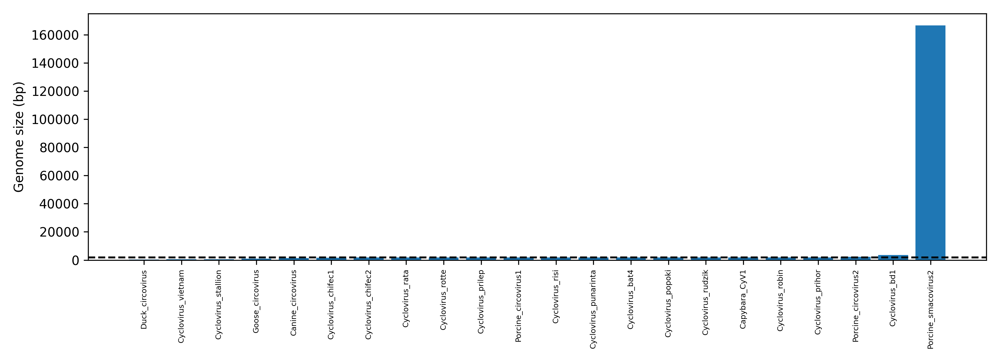

Matthew Lippincott Sequence Analysis Final Project:
Chosen Virus: Capybara associated Cyclovirus 1, MK947371

Virus Classification:
	ICTV Classifications 
		Realm: Monodnaviria
		Kingdom: Shotokuvirae
		Phylum: Cressdnaviricota
		Class: Arfiviricetes
		Order: Cirlivirales
		Family: Circoviridae
		Genus: Cyclovirus
		Species: Cyclovirus roedor
		
	Baltimore Classification:
		Capabara Cyclovirus is classified under Group two of the baltimore classifcation system.
		Group two is categorized by being single stranged (ssDNA) and using a replication strategy
		that converts dsDNA to mRNA.
	
	What is the physical size of my virus?:
		The physical size of Capybara associated Cyclovirus:
			In nm the size of my Capybara virus is typically between 17 and 20 nm.
			For comparison a human cell is 10 to 20 thousand nm and SARS-CoV-2 is about 60-140 nm.
			
	What is the shape of my virus? Does it have an envelope?:
		Capabara cyclovirus has no envelope and the shape of a virus takes a "Icosahedral" shape
		that can be described as a 20 sided dice.
		
		
	When was my virus first described? When was the last outbreak?:
		The first description I could find of my virus was August 2nd, 2019. 
		The paper describing Capabara Cyclovirus was published in Brazil ( the paper says the virus was found
		in capybara feces)
		
		I couldnt find any information detailing a problamtic outbreak of capybara cyclovirus.
		Cycloviruses typically dont cause large problamatic outbreaks.
		
	What does my virus infect? Is it specific to a particular host?
		My virus infects capybara's and has only been found in the fecal samples of Capybara's. 
		Although you can find other cycloviruses in other types of animals such as mammals.
		It is possible that Capybaras might be accidental hosts as they could be getting infected
		via something they eat.
		
	How does my virus penetrate the cell?:
		Cycloviruses such as Capabara Cyclovirus most often penetrate cells via
		endocytosis.
		
	How does my virus replicate? Does it have its own genetic machinery or does it hijack its host?:
		My capybara virus replicated via a "rolling-circle mechanism" and it hijacks its hosts machinery for replication.
		The "rolling-circle" mechanism is a process that many small viruses of similar shapes and typically starts with 
		converting ssDNA into double stranded DNA (using the host) and ends with producing newly assembled virus particles.
		
	Does my virus get released into the cell? Does it kill the cell, bud from the host cell, or is it excreted?:
		My capybara virus most likely releases itself into the host cell via lysis which is common in non-enveloped viruses.
		It is excreted by the host cell and it found in feces.
		My virus is possibly infectious to something found in the capybara's diet and not directly infectious to capybaras 
		themselves.
		
	Does my virus show any signs of latency?:
		My virus shows no signs of latency.
	
	Is my virus considered in equilibrium with humans? Does it show any antigenic shift?:
		Capybara Cyclovirus is not in equilibrium with humans as it has never been detected in any humans before.
		Additionally Capybara Cyclovirus has never demonstrated any antigenic shift.
		
	Are there any vaccines available for your virus? What is the mechanism underlying the vaccine?
		No vaccines are are available for capybara cyclovirus as it is just kinda "there" it doesnt do much and
		can be described simply as a passenger within the capybara before it is passed.
		
	Are any anti-viral drugs available for your virus?
		As I stated previously capybara cyclovirus isnt much of a issue as it can be described as a passenger inside the capybara
		and since it causes no issues no anti-viral drugs have been formulated to fight it.
		As far as I can tell there isnt even a drug in development for the virus, it is that non-problimatic. I find this fitting
		since capybaras are often described as "chill" non-problimatic animals. Kind of ironic.
		
		
		
Methods --> design your bioinformatics pipeline:

		#Step 1

		from Bio import Entrez

		Entrez.email = "mlippin1@charlotte.edu"
		handle = Entrez.efetch(db="nucleotide", id="MK947371", rettype="fasta", retmode="text")
		#chnage id with your accession number
		record = handle.read()
		handle.close()

		# To save your fasta file
		with open("MK947371.fasta", "w") as f:
			f.write(record)

		#Step 2

		from Bio import SeqIO
		from Bio.Seq import Seq
		from Bio.SeqUtils import nt_search

		# Load your FASTA file
		file_path = "MK947371.fasta"  # Replace with your virus fasta file
		record = SeqIO.read(file_path, "fasta")
		sequence = record.seq

		# Function to find open reading frames (ORFs)
		def find_orfs(sequence, min_length=300):
			orfs = []
			for frame in range(3):  # Check in all 3 frames
				translated = sequence[frame:].translate()  # Translate our sequence to proteins
				start = None
				for i in range(len(translated)):
					if translated[i] == 'M' and start is None:  # Start codon
						start = i
					elif translated[i] == '*' and start is not None:  # Stop codon
						if i - start >= min_length:  # Check if ORF is longer than 300 bp
							orfs.append(sequence[frame + start*3 : frame + i*3])
						start = None
			return orfs

		# Find ORFs longer than 300 bp
		orfs = find_orfs(sequence, min_length=300)

		# Print ORFs (if any)
		print(f"Found {len(orfs)} ORFs longer than 300 bp.")
		for idx, orf in enumerate(orfs, 1):
			print(f"ORF {idx}: Length {len(orf)} bp")

		# Optionally, save the ORFs to a new FASTA file
		with open("MK947371_ORFs.fasta", "w") as output_file:
			for idx, orf in enumerate(orfs, 1):
				output_file.write(f">ORF_{idx}\n")
				output_file.write(f"{orf}\n")

		print("ORFs saved to MK947371_ORFs.fasta")

		#Step 3

		from Bio import SeqIO

		# Load the ORFs FASTA file
		orfs = list(SeqIO.parse("MK947371_ORFs.fasta", "fasta"))

		# Translate nucleotide sequences to protein sequences
		proteins = []
		for orf in orfs:
			protein_seq = orf.seq.translate(to_stop=True)
			proteins.append(protein_seq)

		# Save translated proteins to FASTA
		with open("MK947371_proteome.fasta", "w") as out_file:
			for idx, prot in enumerate(proteins, 1):
				out_file.write(f">Protein_{idx}\n")
				out_file.write(str(prot) + "\n")

		print(f"{len(proteins)} proteins saved to MK947371_proteome.fasta")

		#Step 4

		import numpy as np
		from Bio import Entrez
		# In order to import from the python file without hassle, we add the current directory to the python path
		import sys; sys.path.append(".")
		email = "mlippin1@charlotte.edu"

		accession_codes = {
			"Capybara_CyV1":        "MK947371",
			"Cyclovirus_popoki":    "ON596192",
			"Cyclovirus_prihor":    "MZ350968",
			"Cyclovirus_prilep":    "OM262453",
			"Cyclovirus_punarinta": "MZ350966",
			"Cyclovirus_rata":      "KY370028",
			"Cyclovirus_risi":      "LC018134",
			"Cyclovirus_rotte":     "OM869595",
			"Cyclovirus_rudzik":    "MZ350967",
			"Cyclovirus_robin":     "MZ350964",
			"Cyclovirus_chifec1":   "OM262451",
			"Cyclovirus_chifec2":   "OM262452",
			"Cyclovirus_bat4":      "JF938082",
			"Cyclovirus_vietnam":   "JX185349",
			"Cyclovirus_stallion":  "KC771081",
			"Cyclovirus_bd1":       "KP296856",
			# Circovirus genus 
			"Porcine_circovirus1":  "AF055392",
			"Porcine_circovirus2":  "AF311892",
			"Canine_circovirus":    "KF711760",
			"Duck_circovirus":      "AF175102",
			"Goose_circovirus":     "AY140951",
			# Outgroup 
			"Porcine_smacovirus2":  "NC_036074"
		}

		#step 5

		from Bio import Entrez
		import time

		def fetch_fasta_sequences(accession_list, email="mlippin1@charlotte.edu"):
			Entrez.email = email
			sequences = {}
			for accession in accession_list:
				try:
					with Entrez.efetch(
						db="nucleotide",
						id=accession,
						rettype="fasta",
						retmode="text"
					) as handle:
						fasta_data = handle.read().strip()
						sequences[accession] = fasta_data
						print(f"Retrieved: {accession}")
						time.sleep(0.35)
				except Exception as e:
					print(f"Error retrieving {accession}: {str(e)}")
					sequences[accession] = None
			return sequences

		accession_list = list(accession_codes.values())
		sequences = fetch_fasta_sequences(accession_list)

		# Optional: Save results to a FASTA file
		with open("all_sequences.fasta", "w") as f:
			for acc, seq in sequences.items():
				if seq:  # Skip if None
					f.write(seq + "\n")

		#step 6

		from Bio import SeqIO
		from io import StringIO

		def calculate_sequence_lengths(sequences, acc_dict):
			print("\n{:40} | {:15} | {}".format("Virus Name", "Accession", "Sequence Length"))
			print("-" * 70)
			for name, accession in acc_dict.items():
				fasta = sequences.get(accession)
				if not fasta:
					print(f"{name[:40]:40} | {accession:15} | {'Retrieval failed':15}")
					continue
				try:
					record = SeqIO.read(StringIO(fasta), "fasta")
					print(f"{name[:40]:40} | {accession:15} | {len(record.seq):,} bp")
				except Exception as e:
					print(f"{name[:40]:40} | {accession:15} | {'Invalid format':15}")

		# Calculate and display lengths
		calculate_sequence_lengths(sequences, accession_codes)

		#maaft script

		mafft --auto all_sequences.fasta > all_sequences_aligned.fasta

		#Step 7

		from Bio import Phylo, AlignIO
		from Bio.Phylo.TreeConstruction import DistanceCalculator, DistanceTreeConstructor

		# Step 1: Read the alignment
		aln = AlignIO.read("all_sequences_aligned.fasta", "fasta")
		print("Alignment loaded with", len(aln), "sequences.")

		# Step 2: Compute the distance matrix
		calculator = DistanceCalculator('identity')
		distance_matrix = calculator.get_distance(aln)
		print("Distance matrix:\n", distance_matrix)

		# Step 3: Construct the tree using Neighbor-Joining
		constructor = DistanceTreeConstructor()
		nj_tree = constructor.nj(distance_matrix)

		# Optional: Construct UPGMA tree
		# upgma_tree = constructor.upgma(distance_matrix)

		# Step 4: Display the tree
		Phylo.draw(nj_tree)

		# Step 5: Save the tree in Newick format
		Phylo.write(nj_tree, "virus_tree.nwk", "newick")
		print("Tree saved to virus_tree.nwk")

Results and discussion

	Hydrophobicity plot against the E.coli proteome:
	
	

	
	Identify any outlier hydrophobic proteins:
	
		My outlier hydrophobic protein was Protein_1 as my Capybara-associated cyclovirus 1 encodes a single ORF. (My virus is among
		the smallest of all viruses)
		
	Plot the genome size of your virus relative to other viruses:
	
	
	
	Phylogeny and model selection:
	
	
	
		My virus is "MK947371" and my outgroup is "NC_036074" which is a Porcine smacovirus.
		My three most closest relative of my virus are "ON596192", "KC771081", and "AF175102". Which in order are
		Domestic house cat cyclovirus popoki, Horse Cyclovirus stallion, and Mallard duck duck cyclovirus.
		This suggests that the virus switches hosts easily since we have four closely related viruses that 
		have four very different hosts.
		The boostrap values well support the closest relationships in my tree as the values are in the 0.9's suggesting
		a strong relationship.

Sources:
	
	| Source Number | MLA Citation |
|---------------|--------------|
| 1 | "Circoviridae." *ViralZone*, Swiss Institute of Bioinformatics, https://viralzone.expasy.org/7296. |
| 2 | "Family: Circoviridae." *ICTV Report*, International Committee on Taxonomy of Viruses, https://ictv.global/report/chapter/circoviridae/circoviridae. |
| 3 | "The Baltimore Classification System." *News Medical*, 3 Sept. 2018, https://www.news-medical.net/life-sciences/The-Baltimore-Classification-System.aspx. |
| 4 | Ryan, Frank J. "Virus Classification." *Medical Microbiology*, 4th ed., University of Texas Medical Branch at Galveston, 1996, https://www.ncbi.nlm.nih.gov/books/NBK26880/. |
| 5 | "Cyclovirus VN." *NCBI Taxonomy Browser*, National Center for Biotechnology Information, https://www.ncbi.nlm.nih.gov/Taxonomy/Browser/wwwtax.cgi?id=2604905. |
| 6 | Phan, Tung G., et al. "Cyclovirus in human cerebrospinal fluid, Malawi, 2010–2011." *Viruses*, vol. 11, no. 8, 2019, https://doi.org/10.3390/v11080710. |
| 7 | Li, Yingying, et al. "A novel cyclovirus from wild rats in China." *Archives of Virology*, vol. 169, 2024, https://doi.org/10.1007/s00705-024-06107-2. |
| 8 | Altan, Eda, et al. "A highly divergent cyclovirus in the human stool." *Viruses*, vol. 13, no. 11, 2021, https://doi.org/10.3390/v13112155. |
| 9 | Kapoor, Amit, et al. "Characterization of a canine homolog of human cyclovirus." *Vaccine*, vol. 34, no. 10, 2016, pp. 1235–1240, https://doi.org/10.1016/j.vaccine.2016.01.005. |
| 10 | Tan, Le Van, et al. "Cyclovirus in CSF of patients with suspected CNS infections." *Scientific Reports*, vol. 11, 2021, https://doi.org/10.1038/s41598-021-82852-7. |
