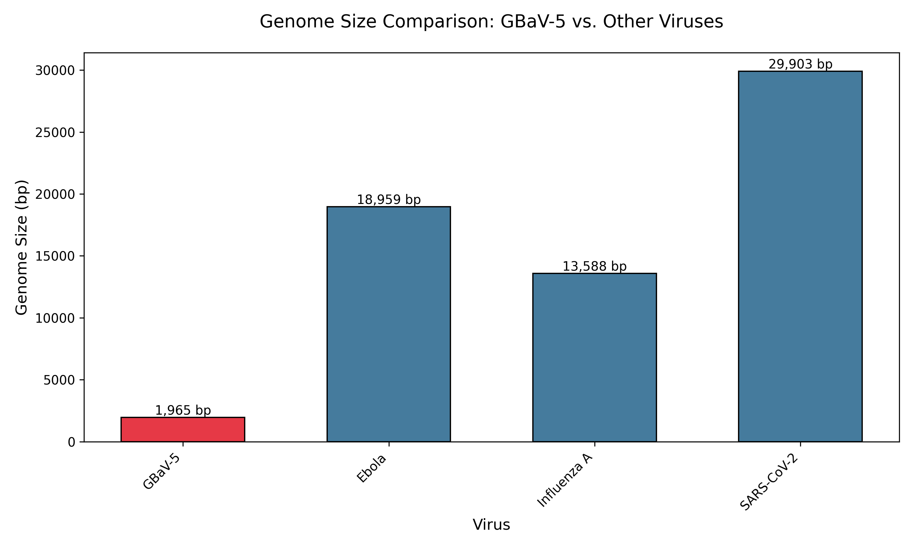

# Introduction

**Viral classification:**  

*ICTV classification* (1):
- Realm: Monodnaviria
- Kingdom: Shotokuvirae
- Phylum: Commensaviricota
- Class: Cardeaviricetes
- Order: Sanitavirales
- Family: Anelloviridae
- Genus: Pitorquevirus
- Species: Pitorquevirus ursid20

*Baltimore classification*: Class II; signle-stranded DNA (ssDNA) viruses (2).

- **Physical size:**  
The physical size of Grizzly bear anellovirus 5 (GBaV-5) is approximately 30 nm, which is smaller than a typical human cell (~10,000 nm) and smaller than SARS-CoV-2 (~120 nm) (3).

- **Shape and envelope:**  
The virus exhibits a spherical, icosahedral symmetry morphology and does not possess an envelope (3).
> **Note**: The structure of GBaV-5 has not been visualized specifically, but can be inferred from other viruses in the Anelloviridae family.

- **Discovery and outbreaks:**  
GBaV-5 was first described in 2017 (4). The most recent outbreak occurred in N/A. Anelloviruses are generally harmless and exist asymptomatically in hosts without causing disease, which indicates it is not a pathogenic relationship (5). Therefore, there have been no documented outbreaks of GBaV-5, or other anelloviruses.

- **Host range:**  
This virus infects This virus infects grizzly bears, and is host-specific (4). This reflects current data, as it has only been found in grizzly bears and anelloviruses are generally species-specific.

- **Cell entry:**  
The virus penetrates the host cell via [mechanism, e.g., endocytosis, membrane fusion, receptor-mediated entry] [insert citation].

- **Replication strategy:**  
GBaV-5 is hypothesized to rely on host machinery and replicates by rolling circle replication (RCR) using DNA polymerases in the nucleus. GBaV-5 lacks its own DNA polymerase, helicase, or other replication enzymes, relying entirely on the bear’s cellular machinery. The viral genome replicates via rolling circle replication, a common mechanism for circular ssDNA viruses (6).

- **Release mechanism:**  
Viral progeny are released by non-lytic exocytosis/vesicles. Similar to human Torque teno virus (TTV), GBaV-5 is hypothesized to exit cells via extracellular vesicles, enabling persistent infection without lysis (7).

- **Latency:**  
No specific studies on GBaV-5, but in human anelloviruses they usually maintain continuous replication without integration into the host genome. This suggests chronic, active persistence rather than latency (8).

- **Equilibrium and antigenic shift:**  
Anelloviruses are typically host-restricted, meaning the virus is almost certainly not in equilibrium with humans. However, it is likely in equilibrium with grizzly bears. Additionally, GBaV-5 does not show antigenic shift. It has a non-segmented, circular single-stranded DNA genome, so it lacks the structure for antigenic shift.

- **Vaccines:**  
No, vaccines are not available. Anelloviruses (including GBaV-5) are not associated with disease in bears or humans, so developing treatments isn’t a priority. Furthermore, since GBaV-5 relies on grizzly bear cellular machinery, it makes it harder to target (9).
> Excerpt from citation: *"According to their virological features, there is little doubt that trying to prevent infections would be extremely difficult in the absence of specific multivalent vaccines. There are no virostatic drugs with proven efficacy for AV infection, and what we know about the lack of AV pathogenicity would not justify specific clinical trials.”*

- **Antiviral drugs:**  
Again, no. Anelloviruses, including GBaV-5, are not associated with disease in bears or humans, so developing treatments isn’t a priority (9).

# Methods
---     

# Results and Discussion
---

# References Cited

1. International Committee on Taxonomy of Viruses (ICTV). (2024). Virus taxonomy. https://ictv.global/taxonomy/taxondetails?taxnode_id=202420419
2. Libretexts. (2024, November 23). 9.3b: The Baltimore Virus Classification. Biology LibreTexts.
https://bio.libretexts.org/Bookshelves/Microbiology/Microbiology_(Boundless)/09:_Viruses/9.03:_Classifying_Viruses/9.3B:_The_Baltimore_Virus_Classification 
3. Anelloviridae. ICTV. (2011). https://ictv.global/report_9th/ssDNA/Anelloviridae 
4. National Center for Biotechnology Information. (2023). *GenBank sequence OP629194: GBaV-5 complete genome.* NIH. https://www.ncbi.nlm.nih.gov/nuccore/OP629194
5. Cebriá-Mendoza M, Beamud B,Andreu-Moreno I, Arbona C, Larrea L, Díaz W,,Sanjuán R, Cuevas JM, 2023. Human Anelloviruses: Influence of Demographic Factors, Recombination, and Worldwide Diversity. Microbiol Spectr11:e04928-22. 
 https://doi.org/10.1128/spectrum.04928-22
6. Sejal Modha, Joseph Hughes, Richard J Orton, Spyros Lytras, Expanding the genomic diversity of human anelloviruses, Virus Evolution, Volume 11, Issue 1, 2025, veaf002. https://doi.org/10.1093/ve/veaf002
7. Qian W, Miner CA, Ingle H, Platt DJ, Baldridge MT, Miner JJ2019. A Human STAT1 Gain-of-Function Mutation Impairs CD8+ T Cell Responses against Gammaherpesvirus 68. J Virol93:10.1128/jvi.00307-19. https://doi.org/10.1128/jvi.00307-19
8. Maggi, F., Fornai, C., Vatteroni, M.L., Siciliano, G., Menichetti, F., Tascini, C., Specter, S., Pistello, M. and Bendinelli, M. (2001), Low prevalence of TT virus in the cerebrospinal fluid of viremic patients with central nervous system disorders. J. Med. Virol., 65: 418-422. https://doi.org/10.1002/jmv.2051
