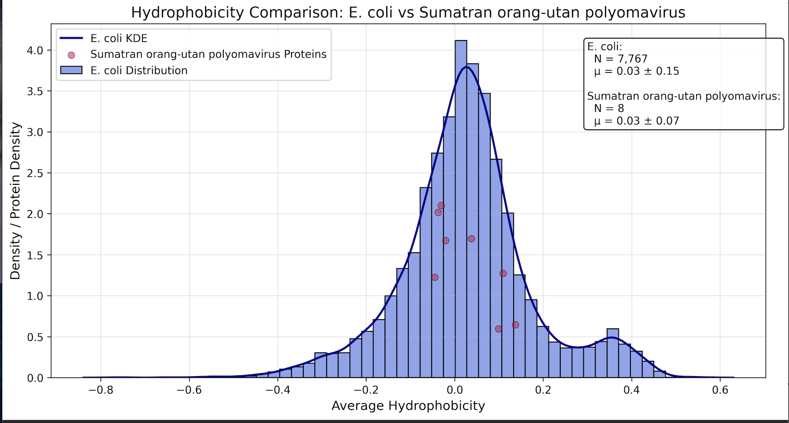
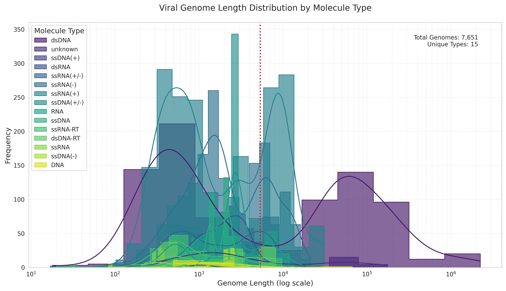

# Introduction
Make sure to have a look at the suggested powerpoint to help guide you! Include some pictures (make sure to cite sources!)

- **Viral classification:**
  - *ICTV classification*: [Orthopolyomavirus](https://link.springer.com/article/10.1007/s00705-011-1008-x)
  - *Baltimore classification*: [Class I (dsDNA)]

- **Physical size:**
  - The physical size of [Sumatran orang-utan polyomavirus] is approximately 45 nm, which is [smaller] than a typical human cell (~10,000 nm) and [smaller] than SARS-CoV-2 (~120 nm) [[ICTV Report](https://ictv.global/report_9th/dsDNA/Polyomaviridae)].

- **Shape and envelope:**
  - The virus exhibits a [icosahedral] morphology and [does not] possess an envelope [https://ictv.global/report_9th/dsDNA/Polyomaviridae].

- **Discovery and outbreaks:**
  - [Sumatran orang-utan polyomavirus] was first described in [2010] [[Discovery](https://pubmed.ncbi.nlm.nih.gov/19923267/)]. The most recent "outbreak" occurred in [IndoChina, 2010] [[NCBI](https://pubmed.ncbi.nlm.nih.gov/19923267/)].

- **Host range:**
  - This virus infects [Sumatran Orangutans], and is [host-specific](https://link.springer.com/article/10.1007/s00705-011-1008-x)].

- **Cell entry:**
  - The virus penetrates the host cell via [receptor-mediated endocytosis](https://ictv.global/report/chapter/polyomaviridae/polyomaviridae)].

- **Replication strategy:**
  - [Sumatran orang-utan polyomavirus] [relies on host machinery] and replicates by [entering hosts nucleus and kickstarts DNA replication by recruiting host enzymes](https://ictv.global/report/chapter/polyomaviridae/polyomaviridae)

- **Release mechanism:**
  - Viral progeny are released by [cell lysis](https://ictv.global/report/chapter/polyomaviridae/polyomaviridae)

- **Latency:**
  - [After the intial infection, the virus may enter a latent phase and lay dormant for some time](https://ictv.global/report/chapter/polyomaviridae/polyomaviridae)

- **Equilibrium and antigenic shift:**
  - [The virus would appear to not be in Equilibrium with Humans and there is no signs of an antigenic shift.](https://ictv.global/report/chapter/polyomaviridae/polyomaviridae)].

- **Vaccines:**
  - [I cannot find any mention of Vaccines.] 

- **Antiviral drugs:**
  - [I cannot find any mention of Antiviral drugs.]

# Methods

1. **First, I downloaded the viral sequence by accession number, and selected XXX close relatives to identify a most recent common ancesstor**  Use the provided accession number (Column X) to download the viral genome sequence. Show the python code for each of the functions you performed.

2. **Second, I Found the ORFs for my sequence** I used a given Python function and used that to find the ORF's, This gave me my FN356901_ORFs.fasta file.

3. **Third, I exported my Proteome File** I used a given Python function to export my Viruses Proteome and saves it to a FASTA file.

4. **Fourth, I prepared Accession Codes for viruses similar to my own** With these codes ready I will next run them through and collect all of their FASTA files.

5. **Fifth, I will Fetch the FASTA Sequences related to the Accession Codes I prepared in Step 4** With a Python script I will run through the Accession Codes dictionary I have made and store them into a Sequences list.

6. **Next, I ran a Python Script that will Calculate Sequence Length for me.** Using this script to find calculate the length of the sequence I will be ready for my next step of running the Mafft Script.

7. **Almost done, I had to run my Mafft alignment script.** After running this Bash script we have aligned all of our sequences together and stored it into all_sequences_aligned.fasta.

8. **Finally for this Part I will be running a few Python Scripts to give us our Tree.** After running the scripts I now have my tree, virus_tree.nwk.

```python

Step 1. Download Virus Sequence

#Insert python code after each step
from Bio import Entrez

Entrez.email = "jbrokaw1@charlotte.edu"
handle = Entrez.efetch(db="nucleotide", id="FN356901", rettype="fasta", retmode="text")
# Change 'id' to your accession number
record = handle.read()
handle.close()

# Save the FASTA file
with open("FN356901.fasta", "w") as f:
    f.write(record)

Step 2. Find ORFs

from Bio import SeqIO
from Bio.Seq import Seq

# Load the FASTA file
file_path = "FN356901.fasta"  # Replace with your virus file
record = SeqIO.read(file_path, "fasta")
sequence = record.seq

# Function to find ORFs
def find_orfs(sequence, min_length=300):
    orfs = []
    for frame in range(3):  # Check all 3 frames
        translated = sequence[frame:].translate()
        start = None
        for i in range(len(translated)):
            if translated[i] == 'M' and start is None:
                start = i
            elif translated[i] == '*' and start is not None:
                if i - start >= min_length:
                    orfs.append(sequence[frame + start*3 : frame + i*3])
                start = None
    return orfs

# Find and print ORFs
orfs = find_orfs(sequence, min_length=300)
print(f"Found {len(orfs)} ORFs longer than 300 bp.")

for idx, orf in enumerate(orfs, 1):
    print(f"ORF {idx}: Length {len(orf)} bp")

# Save the ORFs to a FASTA file
with open("FN356901_ORFs.fasta", "w") as output_file:
    for idx, orf in enumerate(orfs, 1):
        output_file.write(f">ORF_{idx}\n")
        output_file.write(f"{orf}\n")

print("ORFs saved to FN356901_ORFs.fasta")

Step 3. Export Proteome

from Bio import SeqIO

# Load ORFs
orfs = list(SeqIO.parse("FN356901_ORFs.fasta", "fasta"))

# Translate to proteins
proteins = []
for orf in orfs:
    protein_seq = orf.seq.translate(to_stop=True)
    proteins.append(protein_seq)

# Save to FASTA
with open("FN356901_ORFs.fasta", "w") as out_file:
    for idx, prot in enumerate(proteins, 1):
        out_file.write(f">Protein_{idx}\n")
        out_file.write(str(prot) + "\n")

print(f"{len(proteins)} proteins saved to FN356901_ORFs.fasta")

Step 4. Prepare Accession Codes 

accession_codes = {

    #
    
    # 15 Viruses
    "OraPyV-Sum": "FN356900",
    "RacPyV": "JQ178241",
    "BatPyV5b-1": "AB972944",
    "LIPyV": "KY404016",
    "PtrovPyV3": "JX159980",
    "MCPyV": "HM011556",
    "PtrovPyV4": "JX159981",
    "RnorPyV1": "KR075943",
    "SaraPyV1": "MF374997",
    "BatPyV3a-A1055": "JQ958886",
    "OtomopsPyV2": "JX520658",
    "MnatPyV2": "MG701350",
    "MschPyV2": "LC185216",
    "PtrovPyV1a": "HQ385746",
    "PtrosPyV2": "JX159983",

    # 5 Viruses
    "BatPyV2c": "JQ958887",
    "CalbPyV1": "JX159988",
    "CprePyV1": "MK883808",
    "CfamPyV1": "KY341899",
    "CeryPyV1": "JX159985",

    # OutGroup
    "HPV32": "X74475"
}

Step 5. Fetch Fasta Sequences for Codes

from Bio import Entrez
import time

def fetch_fasta_sequences(accession_list, email="jbrokaw1@charlotte.edu"):
    Entrez.email = email
    sequences = {}

    for accession in accession_list:
        try:
            with Entrez.efetch(
                db="nucleotide",
                id=accession,
                rettype="fasta",
                retmode="text"
            ) as handle:
                fasta_data = handle.read().strip()
                sequences[accession] = fasta_data
                print(f"Retrieved: {accession}")
                time.sleep(0.35)

        except Exception as e:
            print(f"Error retrieving {accession}: {str(e)}")
            sequences[accession] = None

    return sequences

accession_list = {
    # 15 Viruses
    "OraPyV-Sum": "FN356900",
    "RacPyV": "JQ178241",
    "BatPyV5b-1": "AB972944",
    "LIPyV": "KY404016",
    "PtrovPyV3": "JX159980",
    "MCPyV": "HM011556",
    "PtrovPyV4": "JX159981",
    "RnorPyV1": "KR075943",
    "SaraPyV1": "MF374997",
    "BatPyV3a-A1055": "JQ958886",
    "OtomopsPyV2": "JX520658",
    "MnatPyV2": "MG701350",
    "MschPyV2": "LC185216",
    "PtrovPyV1a": "HQ385746",
    "PtrosPyV2": "JX159983",

    # 5 Viruses
    "BatPyV2c": "JQ958887",
    "CalbPyV1": "JX159988",
    "CprePyV1": "MK883808",
    "CfamPyV1": "KY341899",
    "CeryPyV1": "JX159985",

    # OutGroup
    "HPV32": "X74475"
}

sequences = fetch_fasta_sequences(accession_list)

# Save all sequences
with open("all_sequences.fasta", "w") as f:
    for acc, seq in sequences.items():
        if seq:
            f.write(seq + "\n")

Step 6. Calculate Lenghts

from Bio import Entrez
from Bio import SeqIO
from io import StringIO

def calculate_sequence_lengths(sequences, accession_codes):
    print("\n{:40} | {:15} | {}".format("Virus Name", "Accession", "Sequence Length"))
    print("-" * 70)

    for name, accession in accession_codes.items():
        fasta = sequences.get(name)
        if not fasta:
            print(f"{name[:40]:40} | {accession:15} | {'Retrieval failed':15}")
            continue

        try:
            record = SeqIO.read(StringIO(fasta), "fasta")
            print(f"{name[:40]:40} | {accession:15} | {len(record.seq):,} bp")
        except Exception as e:
            print(f"{name[:40]:40} | {accession:15} | {'Invalid format':15}")

# Call the function (you'd define `accession_codes` earlier)
calculate_sequence_lengths(sequences, accession_codes)

Step 7. Run Mafft Script

mafft --auto all_sequences.fasta > all_sequences_aligned.fasta

Step 8. Build Trees 

from Bio import Phylo, AlignIO
from Bio.Phylo.TreeConstruction import DistanceCalculator, DistanceTreeConstructor

# Step 1: Read alignment
aln = AlignIO.read("all_sequences_aligned.fasta", "fasta")
print("Alignment loaded with", len(aln), "sequences.")

# Step 2: Distance matrix
calculator = DistanceCalculator('identity')
distance_matrix = calculator.get_distance(aln)
print("Distance matrix:\n", distance_matrix)

# Step 3: Construct NJ tree
constructor = DistanceTreeConstructor()
nj_tree = constructor.nj(distance_matrix)

# Step 4: Display and save tree
Phylo.draw(nj_tree)
Phylo.write(nj_tree, "virus_tree.nwk", "newick")
print("Tree saved to virus_tree.nwk")


```
...Follow the additional methods instructions in the text. Make sure to include your code where relevant! For example, if you used a slurm script, make sure to paste it in here.

e.g.
Align your sequences using the MAFFT slurm script
```bash
#!/bin/bash
#SBATCH --partition=Centaurus
#SBATCH --job-name=mafft
#SBATCH --nodes=1
#SBATCH --ntasks-per-node=1
#SBATCH --time=48:00:00
#SBATCH --mem-per-cpu=200G

echo "======================================================"
echo "Start Time  : $(date)"
echo "Submit Dir  : $SLURM_SUBMIT_DIR"
echo "Job ID/Name : $SLURM_JOBID : $SLURM_JOB_NAME"
echo "Node List   : $SLURM_JOB_NODELIST"
echo "Num Tasks   : $SLURM_NTASKS total [$SLURM_NNODES nodes @ $SLURM_CPUS_ON_NODE CPUs/node]"
echo "======================================================"
echo ""


mkdir tmp
export TMPDIR=$SLURM_SUBMIT_DIR/tmp

module load mafft
cd $SLURM_SUBMIT_DIR

mafft --auto accesssion_sequences.fasta > all_sequences_aligned.fasta


echo ""
echo "======================================================"
echo "End Time   : $(date)"
echo "======================================================"

```

# Results and Discussion

Present your results, including tables, figures, and summary statistics. This should be written more like a text document. Make sure you follow the instructions about which plots to paste within here and reference them as figures (e.g., Fig. 1) when you are describing them.

(10 points) Hydrophobicity plot agains the E.coli proteome

**Figure One** This figure shows my hydrophobicity plot. The plot displays a fairly normal distribution of data, and nothing too extreme. The Sumatran orang-utan polyomavirus proteins are somewhat scattered, but overall fall within an expected range. There is one outlier protein that appears, but I could not definitively identify what it is. I believe that my Sumatran virus generally fits within the expected hydrophobicity range.



(10 points) Identify any of your outlier hydrophobic proteins and BLAST them. What did these sequences annotate as? Might they have any important function to viral entry?

**Identify Outliers** For this, I believe that my ORF5 is an outlier. When I ran a BLAST, it returned as a basic protein sequence, and I was not fully sure what it annotated as. I believe this protein might be part of the virus’s outer layer, which is why its hydrophobicity is significant. This may be important for viral entry because proteins in the viral envelope or membrane often interact directly with host cells, potentially facilitating entry.

**Figure Two** This figure represents my viral genome histogram. The graph shows that the Sumatran orang-utan polyomavirus is a relatively small dsDNA virus, with a size of about 5,500 bp, which is smaller than average for dsDNA viruses.

(10 points) Plot the genome size of your virus relative to other viruses (see code from lab 9.12b).



(20 points) Phylogeny and model selection. Use figtree to root the tree to your outgroup, make it look nice by ordering the nodes, increasing tip label size. State and interpret the best fit model used to infer this phylogeny. Display the bootstrap values. Discuss about your results. What are the three closest relatives of your virus, does it suggest a host switch? Are the branches well-supported by bootstrap values?


**Figure Three** Regarding my Virus it is very similar to the following, PtrovPyV4, PtrovPyV3 and FN356900.1 which is the Bornean orang-utan polyomavirus. In my opinion this doesn't really show any evidence of a recent host switch. I would also say that my branches are well supporting of my bootstrap values.


# References Cited

Use at least five references, formatted using a numbering system (1) or (Doe, et al. 2024). List the references in the appropriate bibliography format here. Use markdown to have all of your text references link to the bottom part of the page to where the reference is listed.


1. Krumbholz, A., et al. (2009). Identification of a novel polyomavirus in orangutans. *Archives of Virology*, 154(8), 1275–1279. [Link](https://link.springer.com/article/10.1007/s00705-011-1008-x)

2. International Committee on Taxonomy of Viruses (ICTV). (2012). Polyomaviridae. In *Virus Taxonomy: Ninth Report of the International Committee on Taxonomy of Viruses*. [Link](https://ictv.global/report_9th/dsDNA/Polyomaviridae)

3. International Committee on Taxonomy of Viruses (ICTV). (2023). Chapter: Polyomaviridae. [Link](https://ictv.global/report/chapter/polyomaviridae/polyomaviridae)

4. Scuda, N., et al. (2011). A novel human polyomavirus closely related to Merkel cell polyomavirus. *Journal of Virology*, 85(9), 4586–4590. [PubMed](https://pubmed.ncbi.nlm.nih.gov/19923267/)

5. Moens, U., et al. (2013). Polyomaviruses in animals: characterisation of the genome, current knowledge on the pathogenesis, and zoonotic potential. *Acta Veterinaria Scandinavica*, 55, 67. [PMC](https://pmc.ncbi.nlm.nih.gov/articles/PMC3815707/)


